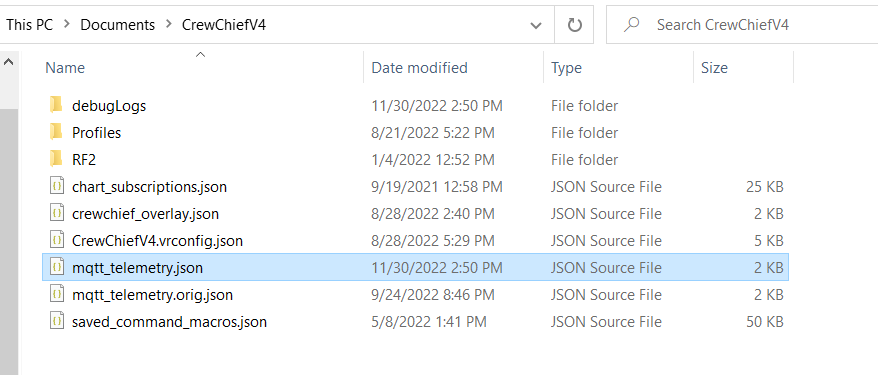
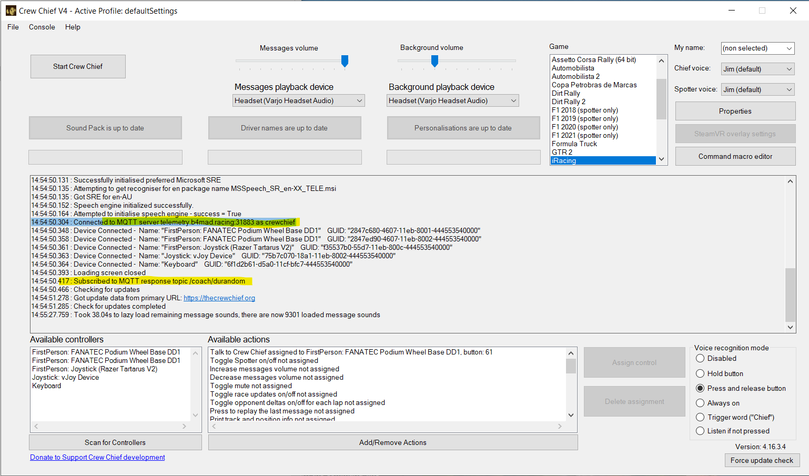

# [#B4mad racing](https://b4mad.racing)

> Community driven SimRacing data collection and analysis.

## A telemetry data collection and analysis pipeline for simracers :racing_car:

The pipeline start at [CrewChief](https://thecrewchief.org/).
This means we can take data in from any simulation that CrewChief supports.
CrewChief will send your simulator telemetry data to an endpoint hosted on the [Operate First Community Cloud](https://www.operate-first.cloud).
You can then visualize your telemetry data in our [B4mad Pitwall](https://pitwall.b4mad.racing/)
or do some [data science](ai/)


## Installation

1. Install [CrewChief](https://thecrewchief.org/)
2. Enable the telemetry collection by checking 'MQTT Telemetry enabled' in the CrewChief options
3. Choose a 'MQTT drivername' in the CrewChief options 
4. Enable text to speech 
5. Download [mqtt_telemetry.json](docs/mqtt_telemetry.json) and place it in the CrewChief Documents folder 
6. If all works you should see connection messages in the CrewChief console 

Drive some laps to send some initial data. Now any time you run your simulator you will be sending data.

## Coaches

At [Paddock](https://paddock.b4mad.racing) find your drivername and enable the coach.

## Visualization

Head over to the [B4mad Pitwall](https://pitwall.b4mad.racing) and explore your
recent sessions or signup for an account to create new dashboards.


Check out the [flux scratchpad](flux/SCRATCH.flux) for some
[flux](https://docs.influxdata.com/flux/v0.x/) query examples.

## Hacking

## docker-compose stack

```shell
cd docker-compose
docker-compose up
```

### influx

Go to http://localhost:8086/ and login with [configuration.env](docker-compose/configuration.env)
and explore the racing bucket

- https://github.com/InfluxCommunity/InfluxDBv2_Telegraf_Docker

#### connecting to influx

```shell
# create a config with a reader token
influx config create --active -n b4mad_reader -u https://telemetry.b4mad.racing -t "citqAMr66LLb25hvaaZm2LezOc88k2ocOFJcJDR6QB-RmLJa_-sAr9kYB4vSFYaz8bt26lm7SokVgpQKdgKFKA==" -o b4mad

# count the number of sessions in the last 24 hours
influx query 'from(bucket:"racing") |> range(start:-1d) |> keep(columns: ["SessionId"])|> group()|> distinct(column: "SessionId") |> count()'
Result: _result
Table: keys: []
                _value:int
--------------------------
                      1788

``

### telegraf

```shell
docker compose exec telegraf cat /tmp/metrics.out
docker compose restart telegraf
```

### mosquitto

publish stuff

```shell
docker-compose exec mosquitto mosquitto_pub  -u admin -P admin -t racing -m '{"a": 5}'
docker-compose exec mosquitto mosquitto_pub  -u admin -P admin -t racing -m "`cat ../sample-small.json`"
```

subscribe

```shell
docker-compose exec mosquitto mosquitto_sub  -u admin -P admin -t racing/\# -d
docker-compose exec mosquitto mosquitto_sub  -p 31883 -h telemetry.b4mad.racing -u admin -P admin -t crewchief/\# -d
```

- <https://github.com/eclipse/paho.mqtt.python>
- <https://github.com/kevinboone/mosquitto-openshift>

### grafana

Export data sources

```shell
curl -s "http://localhost:3000/api/datasources" -u admin:admin | jq -c -M '.[]'
```


# CD

[](https://argocd.operate-first.cloud/applications/racing-smaug)
